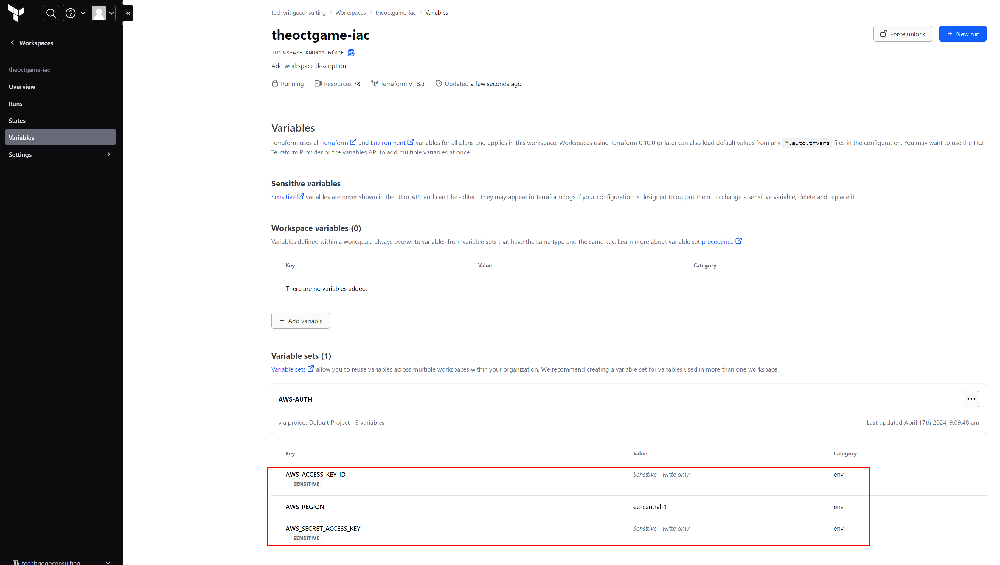
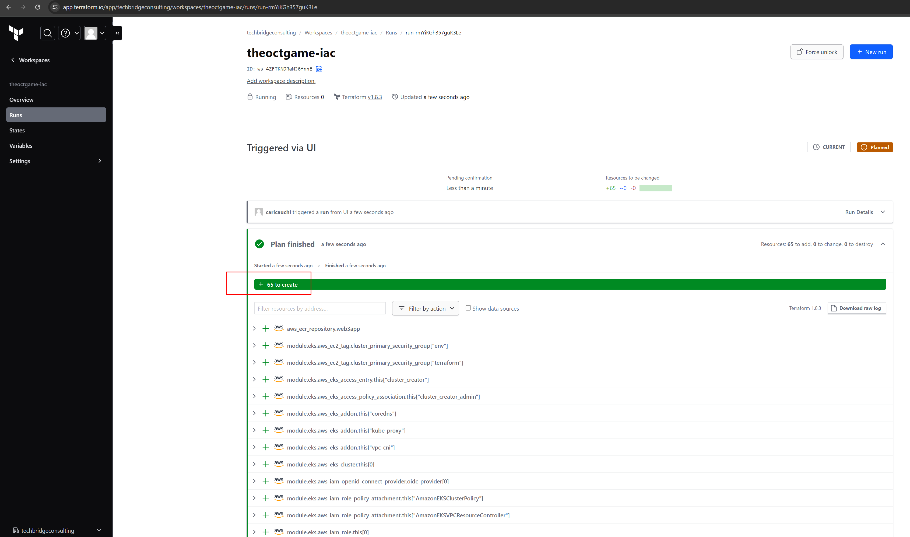

# theoctgame-iac
The OCT Game - Infrastructure as Code

## Prerequisites

- AWS account
- Terraform Cloud (free tier) or a local Terraform installation

## Setup Instructions

### AWS Setup

1. Create an IAM User and assign the correct role to be used by the terraform process.
2. Genereate an AWS Access Key for this User.

### Add necessary secrets to your Terraform Workspace settings:

1. Create an AWS Access Key ID and setup a Github Secret: `AWS_ACCESS_KEY_ID`
2. Create an AWS Secret Access Key setup a Github Secret: `AWS_SECRET_ACCESS_KEY`

### Applying Terraform

1. Link your new Workspace in Terraform Cloud with this GitHub Repo.
2. Run a Terraform Plan & Apply.

